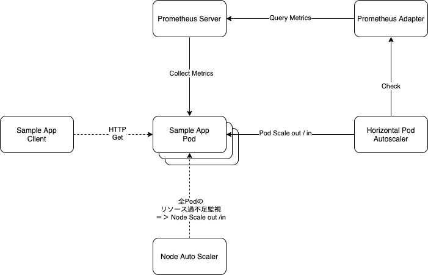

# scaler-by-session

## System Structure



## repository structure

```
 (root) + - server サンプルアプリケーションサーバ
        |
        + - client サンプルアプリケーションクライアント
        |
        + - setup  + - (Makefile) eks cluster作成コマンドランナー
                   |
                   + - k8s アプリケーションdeployment, service構築用yaml
                   |
                   + - prometheus Prometheus server/ adapter 構築コマンドランナー
```

## Prerequisit

- [aws-cliのインストール](https://docs.aws.amazon.com/ja_jp/cli/latest/userguide/install-cliv2.html)
- [eksctlのインストール](https://docs.aws.amazon.com/ja_jp/eks/latest/userguide/getting-started-eksctl.html)
- [helmのインストール](https://helm.sh/docs/intro/install/)
- ECRを有効化（setup/k8sのyamlのimage URLを設定したECR URLに変更要）
- docker desktopのインストール
- node.js(v14) のインストール

## Setup

- EKSクラスタ作成 setup/Makefile の内容を実行
- Prometheus インストール setup/prometheus で `make setup && make install-all` 実行
- [サーバー環境](server/README.md)
- [クライアント環境](client/README.md)